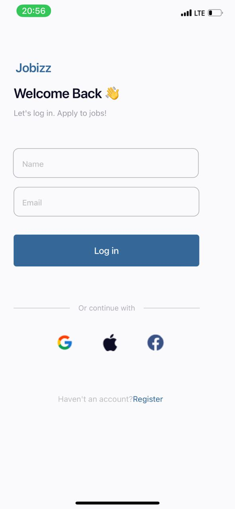

# rn-assignment4-11333031
# Description
This project is a React Native application with a login screen that passes the name and email to the home screen. The home screen displays the name and email and shows lists of popular and featured job cards.

### LoginScreen
- Renders a form with fields for name and email.
- Navigates to the HomeScreen on login with the provided name and email.

### HomeScreen
- Displays the name and email passed from the LoginScreen.
- Renders lists of popular and featured job cards.

### JobCard
- Functional component that accepts job details as props.
- Used to display individual job cards in the HomeScreen.

## Screenshots

